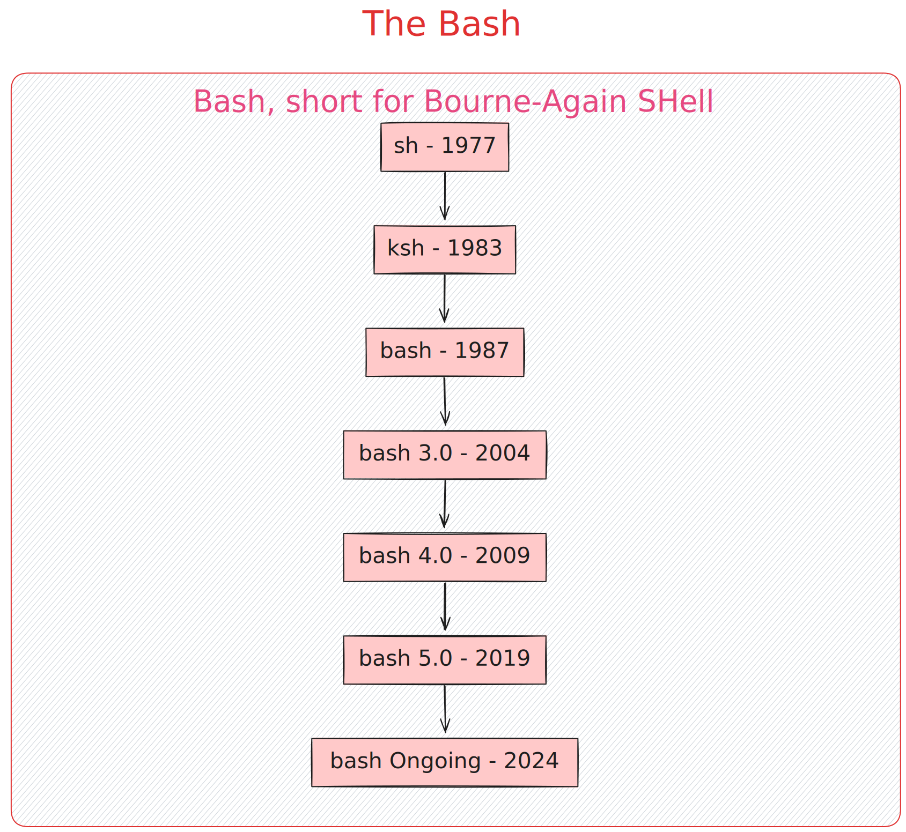

![[PWDL.excalidraw]]

## Basic Usage Of BASH

### `echo` -> Displaying OUTPUT
### `ls` -> **l**i**s**t Files and Folders in a Directory 
### `mkdir` -> Make new directory
### `cd` -> \[c]hange to a \[d]irectory
### `touch` -> (touch) create a new file


Have a quick look at the usages of the commands below 
We will dive into them one by one.


# `ls` : Every Linux User's FIrst Bash Command

## Basic Usages and Flags

The `ls` command is used to list directory contents in Unix-like operating systems. Below are some common usages and flags for the `ls` command.

## Basic Usage

- **List files in the current directory:**
  ```bash
  ls
  ```

- **List files in a specific directory:**
  ```bash
  ls /path/to/directory
  ```

## Common Flags

- **`-a`** or **`--all`**: List all files, including hidden files (those starting with a dot).
  ```bash
  ls -a
  ```

- **`-l`**: Use a long listing format, which provides detailed information such as permissions, number of links, owner, group, size, and timestamp.
  ```bash
  ls -l
  ```

- **`-h`** or **`--human-readable`**: With `-l`, print sizes in human-readable format (e.g., KB, MB).
  ```bash
  ls -lh
  ```

- **`-R`** or **`--recursive`**: List directories and their contents recursively.
  ```bash
  ls -R
  ```

- **`-t`**: Sort by modification time, with the newest files first.
  ```bash
  ls -t
  ```

- **`-S`**: Sort by file size, with the largest files first.
  ```bash
  ls -S
  ```

- **`-r`**: Reverse the order of the sort.
  ```bash
  ls -r
  ```

- **`-i`**: Print the index number (inode) of each file.
  ```bash
  ls -i
  ```

- **`-d`**: List directories themselves, not their contents.
  ```bash
  ls -d */
  ```

- **`--color`**: Control whether to use color for file types (typically enabled by default in many systems).
  ```bash
  ls --color
  ```

## Examples

- **List all files in the current directory, including hidden files, with detailed information:**
  ```bash
  ls -la
  ```

- **List files in a specific directory, sorted by size, with human-readable sizes:**
  ```bash
  ls -lhS /path/to/directory
  ```

- **List all files and directories recursively with detailed information:**
  ```bash
  ls -lR
  ```

- **List all directories in the current directory:**
  ```bash
  ls -d */
  ```

## Combining Flags

Flags can be combined to customize the output. For example, to list all files including hidden ones, with detailed information and human-readable sizes:

```bash
ls -alh
```

This document provides a basic overview of the `ls` command and its commonly used flags. For more detailed information, you can refer to the `ls` man page:

```bash
man ls
```


# Basic Usage of `mkdir`

`mkdir` (make directory) is a command used in Unix and Unix-like operating systems to create directories.

## Syntax

```
mkdir [OPTION] DIRECTORY_NAME
```

## Examples

1. **Create a Single Directory**
    ```bash
    mkdir my_directory
    ```

2. **Create Multiple Directories**
    ```bash
    mkdir dir1 dir2 dir3
    ```

3. **Create Parent Directories**
    ```bash
    mkdir -p parent/child
    ```

4. **Set Permissions**
    ```bash
    mkdir -m 755 new_directory
    ```

## Options

- `-p`, `--parents`  
  Create parent directories as needed.

- `-m`, `--mode`  
  Set file mode (permissions) for the new directories.

- `-v`, `--verbose`  
  Print a message for each created directory.

## Notes

- Ensure you have the necessary permissions to create directories in the specified location.
- Use absolute or relative paths as needed.


# Basic Usage of `cd`, `touch`, and `echo`

## `cd` (Change Directory)

The `cd` command is used to change the current working directory.

### Syntax

```
cd [DIRECTORY]
```

### Examples

1. **Change to a Directory**
    ```bash
    cd my_directory
    ```

2. **Navigate to Parent Directory**
    ```bash
    cd ..
    ```

3. **Navigate to Home Directory**
    ```bash
    cd ~
    ```

4. **Navigate to Previous Directory**
    ```bash
    cd -
    ```

## `touch` (Create or Modify File)

The `touch` command is used to create an empty file or update the timestamp of an existing file.

### Syntax

```
touch [FILE]
```

### Examples

1. **Create a New File**
    ```bash
    touch newfile.txt
    ```

2. **Update File Timestamp**
    ```bash
    touch existingfile.txt
    ```

3. **Create Multiple Files**
    ```bash
    touch file1.txt file2.txt
    ```

## `echo` (Display Message)

The `echo` command is used to display a line of text or a variable's value.

### Syntax

```
echo [STRING]
```

### Examples

1. **Display a Simple Message**
    ```bash
    echo "Hello, World!"
    ```

2. **Display a Variable's Value**
    ```bash
    my_var="Hello, World!"
    echo $my_var
    ```

3. **Print Message Without Newline**
    ```bash
    echo -n "Hello, "
    echo "World!"
    ```

4. **Print Message with Escape Sequences**
    ```bash
    echo -e "Line 1\nLine 2"
    ```

## Notes

- `cd` changes the current directory, `touch` handles file creation and modification, and `echo` is used for text output.
- Use absolute or relative paths with `cd` and `touch`.
