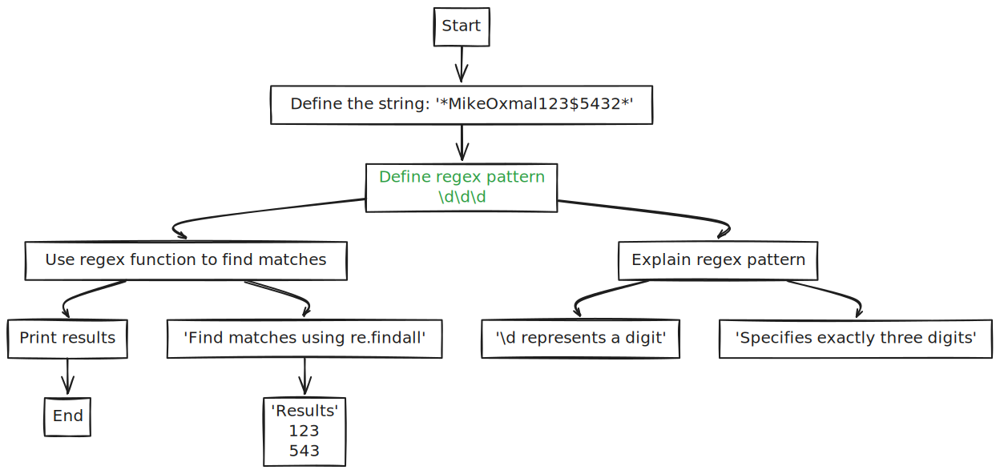

Hello There! Comrade 
Still Sticking Around ? 
So lets Get Our Hands Grabby!!

## Syntax
- `grep [options] search_string path/to/file`

```python

import random
import datetime

# This is a sample Python file with 100 lines
# It contains various functions, classes, and comments

def generate_random_number(min_val, max_val):
    return random.randint(min_val, max_val)

class Person:
    def __init__(self, name, age):
        self.name = name
        self.age = age

    def greet(self):
        print(f"Hello, my name is {self.name} and I'm {self.age} years old.")

def is_prime(n):
    if n < 2:
        return False
    for i in range(2, int(n**0.5) + 1):
        if n % i == 0:
            return False
    return True

# List comprehension example
squares = [x**2 for x in range(10)]

def fibonacci(n):
    if n <= 1:
        return n
    else:
        return fibonacci(n-1) + fibonacci(n-2)

print("Welcome to the random Python file!")

# Dictionary example
fruits = {
    "apple": "red",
    "banana": "yellow",
    "grape": "purple",
    "orange": "orange"
}

def reverse_string(s):
    return s[::-1]

class Car:
    def __init__(self, make, model, year):
        self.make = make
        self.model = model
        self.year = year

    def describe(self):
        print(f"This is a {self.year} {self.make} {self.model}.")

# Lambda function example
double = lambda x: x * 2

def calculate_age(birth_year):
    current_year = datetime.datetime.now().year
    return current_year - birth_year

# Tuple example
coordinates = (10, 20, 30)

def celsius_to_fahrenheit(celsius):
    return (celsius * 9/5) + 32

print("This file contains various Python concepts.")

# Set example
unique_numbers = {1, 2, 3, 4, 5, 5, 4, 3, 2, 1}

def count_vowels(string):
    vowels = "aeiouAEIOU"
    return sum(1 for char in string if char in vowels)

class Rectangle:
    def __init__(self, width, height):
        self.width = width
        self.height = height

    def area(self):
        return self.width * self.height

def is_palindrome(s):
    return s == s[::-1]

# List example
colors = ["red", "green", "blue", "yellow", "purple"]

def factorial(n):
    if n == 0 or n == 1:
        return 1
    else:
        return n * factorial(n-1)

print("Feel free to use grep to search this file!")

def generate_password(length):
    chars = "abcdefghijklmnopqrstuvwxyzABCDEFGHIJKLMNOPQRSTUVWXYZ0123456789!@#$%^&*()"
    return ''.join(random.choice(chars) for _ in range(length))

class BankAccount:
    def __init__(self, balance):
        self.balance = balance

    def deposit(self, amount):
        self.balance += amount

    def withdraw(self, amount):
        if amount <= self.balance:
            self.balance -= amount
        else:
            print("Insufficient funds")

def binary_search(arr, target):
    left, right = 0, len(arr) - 1
    while left <= right:
        mid = (left + right) // 2
        if arr[mid] == target:
            return mid
        elif arr[mid] < target:
            left = mid + 1
        else:
            right = mid - 1
    return -1

# This is the last line of the file
print("End of the random Python file. Happy grepping!")
```


## Why use Grep ? 

We use `grep` to search for specific patterns or strings within files or command outputs in Linux. It's an essential tool for **quickly locating information in large text files**, logs, or outputs, **helping you filter data to focus on what's relevant**. 

By using `grep`, you can improvise your workflow by making data extraction and filtering more efficient, especially when dealing with extensive and complex files or outputs.


## The First Grep Command 

`grep random my_python_file.py`
  
  

Note: This command will display **the lines that contain** the word '***random***'.

Notice that there are no Line Numbers. If we enable the line numbers it will be easier for us to get the exact line where the string ***'random'*** is matched.
We can enable **line numbers** using `-n` option.

`grep -n random my_python_file.py`
  
  

## Partial And Complete Searching

### By default GREP uses Partial Search

Lets say we need to serach for all the instatnces where "self" or '**=***'
occur on the same line.
Searching this is as simple as running:

`grep -n self = my_python_file.py`


### Complete word search 

Lets say you need to search for all the instances that has a word called "\_\_init\_\_" (actually a special python function). So we will use the `-w` flag.
`grep -nw __init__ my_python_file.py`

Output:
```bash
11:    def __init__(self, name, age):
49:    def __init__(self, make, model, year):
80:    def __init__(self, width, height):
106:    def __init__(self, balance):
```
## REGEX - the Ultimate
Regex is the most common way to find strings.

Regex is provided out of the box by python. Grep provides **limited** support for regex.

### What is Regex? 
Regex is used to find a *find* a ***pattern*** in a `test_string`.
Lets  say you want to find a 3 digit number in a string such as "*MikeOxmal123$5432*"
Firstly,
We define a regex_pattern; `\d\d\d` (Notice that `\d` represents a digit and three `\d` represents three digits)
Next we pass the regex_compiler. 




### Consider checking out 
To know about regexes : [W3 Schools Python Regex Reference](https://www.w3schools.com/python/python_regex.asp)
To practice : [Regex101](https://regex101.com/)

### GREP - Limited Regex Support 
Grep supports `perl`  regex out of the box. 
However we will not use them. Instead we will use Extended Regex which is much better for 'normal' use cases.

Lets say we need to find all '**words**' enclosed in double quotes (") in our python file.

Regex Pattern : "\\w+"

Explanation:
	The string must begin with (") hence first *"*  is used and the word must end with the same and hence second *"* is used.
	\\w specifies a word 
	*+* specifies multiple word
We use `-E` to specify for Extended Regex.
`grep -nE '"\w+\"' my_python_file.py`

Output:
```bash
39:    "apple": "red",
40:    "banana": "yellow",
41:    "grape": "purple",
42:    "orange": "orange"
76:    vowels = "aeiouAEIOU"
```

### Output only the matched string

Notice that `grep` always returns the output of the line wgere string(s) are matched.
If we want to view the matched words we specify the `-o` flag.

`grep -nEo '"\w+\"' my_python_file.py`

Output:
Notice that the output is much more cleaner and thus easier to analyse.
```bash
39:"apple"
39:"red"
40:"banana"
40:"yellow"
41:"grape"
41:"purple"
42:"orange"
42:"orange"
76:"aeiouAEIOU"
91:"red"
91:"green"
91:"blue"
91:"yellow"
91:"purple"
```
